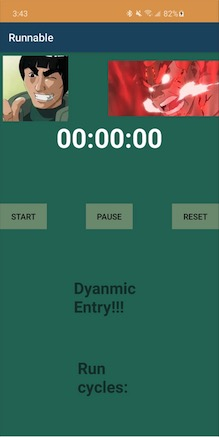

# DYNAMICCCCC ENTRY!!!

welcome to my humble running app! Nothing fancy here, but I'm hoping that it'll help me on my runs!  
Yes, the name is INDEED a pun made off of the "runnable" JAVA interface.  

## Why??
Great question, anonymous friend. Why make a running app? Aren't there thousands out there?  
There are, but none like this one. First of all, I'm training to run a marathon by the end of this year (2020).  
On May 28th, I ran my first half marathon, and I'm using Jeff Galloway's "Marathon You can do it!" book to help me train for my first full marathon  
I'm using his run-walk-run method, which prescribes running at a fairly fast pace for a couple minutes, then walking for a little, then repeating  
I found myself liking this method of marathon running, but it was SOOOOooo tedious looking down at my watch every three minutes!  
I felt like I couldn't get in the zone when I was constantly looking at my watch. And sooo this baby come to be from my noggin!
Also, I love Might Guy from Naruto and he inspires me to be a better self

## How?
I made a fairly simple Android Stopwatch clone using Android's built-in System Clock and used the built in Vibration so that it will remind me  
whenever I'm supposed to switch from running to walking, or walking to running! Now I can easily have my phone in my pocket or in my hand while I run  
and be notified whenever I'm supposed to alter my gait. Problemo solved!

## Might Guy??
But wait...there's more! I wanted to go beyond a simple stopwatch clone and customize it how I would want it to be. This is my app after all.  
So who is Might Guy? Well if you don't watch anime or Naruto, he's from a Japanese cartoon named "Naruto". In a world full of Ninja who can  
all pull off crazy, super-powerlike, natural-world-defying techniques (spewing waterfalls, blowing fireballs, the like), Might Guy was actually born  
**unable** to do anything like that. He was essentially told he could not be a ninja...but that didn't stop Might Guy. He trained endlessly, for hours and hours  
on end, punching logs until his knuckles were bloody, walking hundreds of meters on his hands; when his classmates put in 1 hour, he put in 20.  
THrough hard work and determination, Might Guy rose to become one of the most legendary and feared Ninja of the Hidden Leaf Village!  
It might sound corny to you...but Might Guy really does motivate me. As a kid, he taught me that I didn't have to be the smartest, the funniest, the most naturally talented.  
Might Guy taught me that my greatest superpower was my own will-power. 

### notes on first run, 07/06  
-Accidentally hitting the reset/start button???? Suxxxx  
-kinda sucks having to hold the phone in a way where the screen is on and your fingers have to be careful about hitting the buttons. I accidentally hit reset or start or something around 40 minutes. Huge bummer.  
-sucks when I have to change apps and stuff too because I can't feel vibrations  
-maybe use notification system instead??  
-overall, it was the concept I was looking for, but with noticeable flaws. Annoying to hold in hand, but vibration was not strong enough where I could feel it in my backpocket. I had some good moments tho, where it was nice to see I was supposed to be running, or to not have to look at my phone and be able to know when to run and when to walk. 5/10 success.  
-dabble in the ability to change up run/walk times  